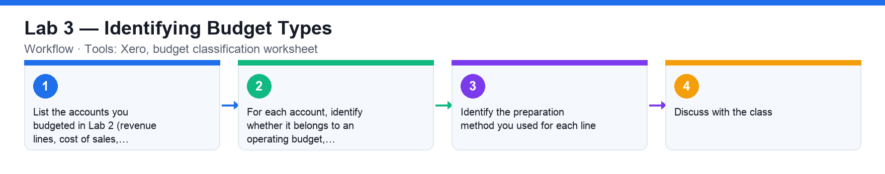
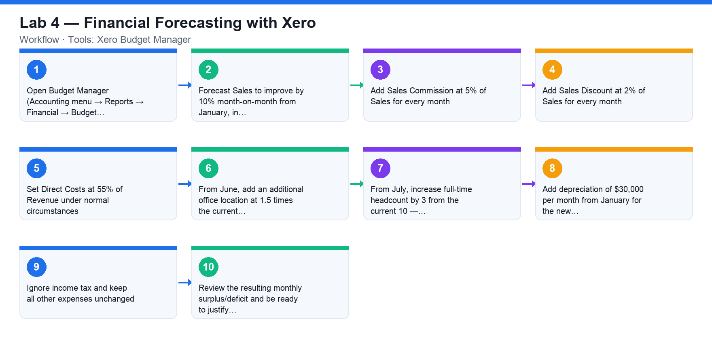
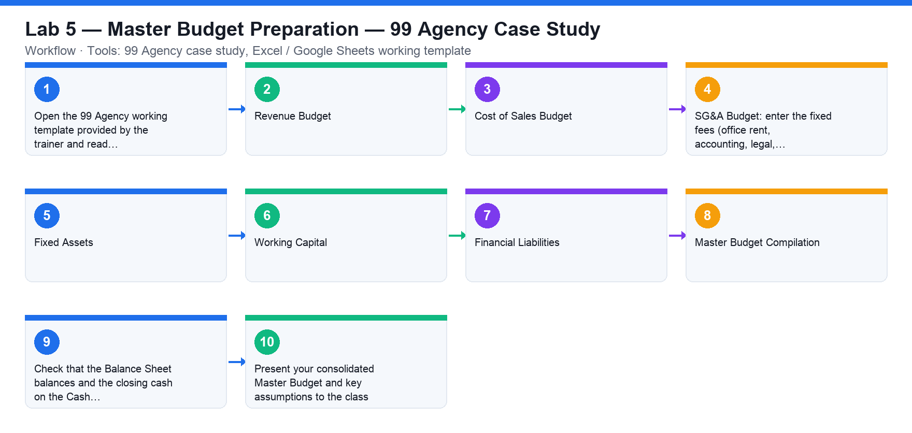
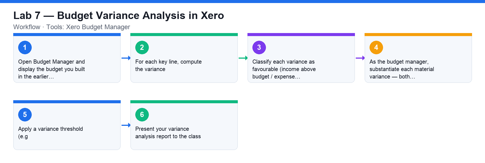
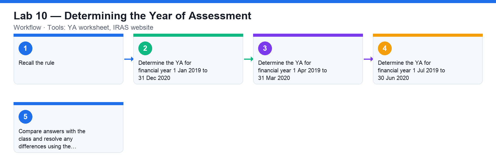

# WSQ Budgeting for Small and Medium Enterprises — Learner Guide

**WSQ Course Code:** TGS-2021002336  |  **Conducted by:** Tertiary Infotech Academy Pte Ltd (UEN 201200696W)  |  **Version v12 · 10 August 2026**

## Contents

- [Introduction](#introduction)
- [Course Learning Outcomes](#course-learning-outcomes)
- [Skills Framework Alignment](#skills-framework-alignment)
- [Before You Start — Environment Setup](#before-you-start--environment-setup)
- [Topic 01 — Introduction to Financial Budgeting](#topic-01--introduction-to-financial-budgeting)
  - [Lab 1 — Financial Statements with Xero](#lab-1--financial-statements-with-xero)
  - [Lab 2 — Creating a Budget in Xero](#lab-2--creating-a-budget-in-xero)
  - [Lab 3 — Identifying Budget Types](#lab-3--identifying-budget-types)
- [Topic 02 — Financial Forecasting](#topic-02--financial-forecasting)
  - [Lab 4 — Financial Forecasting with Xero](#lab-4--financial-forecasting-with-xero)
- [Topic 03 — Budget Preparation](#topic-03--budget-preparation)
  - [Lab 5 — Master Budget Preparation — 99 Agency Case Study](#lab-5--master-budget-preparation--99-agency-case-study)
- [Topic 04 — Budget Control Plan](#topic-04--budget-control-plan)
  - [Lab 6 — Knowledge Check Quiz — Budget Control](#lab-6--knowledge-check-quiz--budget-control)
- [Topic 05 — Budget Analysis](#topic-05--budget-analysis)
  - [Lab 7 — Budget Variance Analysis in Xero](#lab-7--budget-variance-analysis-in-xero)
  - [Lab 8 — Budget Analysis Dashboard with Power BI](#lab-8--budget-analysis-dashboard-with-power-bi)
- [Topic 06 — Budget Approval](#topic-06--budget-approval)
  - [Lab 9 — Knowledge Check Quiz — Budget Approval](#lab-9--knowledge-check-quiz--budget-approval)
- [Topic 07 — Financial Compliance](#topic-07--financial-compliance)
  - [Lab 10 — Determining the Year of Assessment](#lab-10--determining-the-year-of-assessment)
  - [Lab 11 — ECI and Corporate Tax Filing Deadlines](#lab-11--eci-and-corporate-tax-filing-deadlines)
  - [Lab 12 — Start-Up Tax Computation](#lab-12--start-up-tax-computation)
- [Assessment Preparation](#assessment-preparation)
- [Glossary](#glossary)

## Introduction

This Learner Guide accompanies the WSQ course WSQ Budgeting for Small and Medium Enterprises (TGS-2021002336), conducted by Tertiary Infotech Academy Pte Ltd. It provides detailed step-by-step instructions for all 12 hands-on activities, organised by the seven course topics aligned to the Skills Framework TSC Budgeting (ICT-FIN-3001-1.1). The activities use Xero, Microsoft Power BI, Google Forms and case-study templates so that every learning outcome is practised hands-on.

Use this guide alongside the course slides and the activity files in the labs/ folder of the course repository. The slides give each activity a one-page overview; this guide carries the full detailed steps. The final assessment is open book — you may refer to the slides, this Learner Guide and any approved materials.

## Course Learning Outcomes

- LO1: Analyse business strategies and objectives
- LO2: Carry out financial forecasting
- LO3: Prepare budget to meet cash flow requirements
- LO4: Prepare budget control plan
- LO5: Perform financial analysis to highlight discrepancies
- LO6: Report budget and seek approval
- LO7: Perform financial control to ensure compliance

## Skills Framework Alignment

This course is aligned to the Budgeting TSC (ICT-FIN-3001-1.1) under the ICT Skills Framework.

**TSC Abilities**

- A1: Analyse business function strategies, functional objectives and operational plans
- A2: Carry out forecasting and budgeting for the financial year
- A3: Calculate the business unit's cash flow requirements
- A4: Determine the business unit's financing needs for the financial year
- A5: Compare budget data with estimations to highlight discrepancies
- A6: Report budget calculations and discrepancies to organisation management to facilitate decisions on budget allocation
- A7: Ensure adherence to financial controls in accordance with relevant organisational corporate governance and financial policies, legislation and regulations

**TSC Knowledge**

- K1: Objectives, parameters and types of budgets
- K2: Key principles of accounting and financial systems
- K3: Types of data sources and data required to prepare a budget
- K4: Accounting principles and practices related to budget preparation
- K5: Key principles of budgetary control and budget plans, budgetary control techniques
- K6: Requirements of Singapore's taxation policies
- K7: Functional objectives and key requirements
- K8: Organisational financial data
- K9: Financial analytical techniques and methodology
- K10: Stakeholders to consult on budget calculations

## Before You Start — Environment Setup

**What you need**

- A laptop with a modern browser (Chrome, Edge or Safari) and internet access.
- An email address you can access in class — used to sign up for the free Xero trial and Microsoft Power BI accounts.
- The 99 Agency working template and the tax computation template — downloaded from the LMS (lms-tms.tertiaryinfotech.com) or Google Classroom as directed by the trainer.
- Excel, Google Sheets or LibreOffice Calc to work through the case-study schedules.

**Accounts you will create during the course**

- Xero (free 30-day trial, includes the Demo Company) — https://www.xero.com/sg/signup/
- Microsoft Power BI (free trial) — https://powerbi.microsoft.com/en-us/landing/signin/

**Conventions used in every activity**

- Menu paths are written as Menu → Submenu → Item (e.g. Accounting → Reports → Budget Manager).
- Amounts are in Singapore dollars unless stated otherwise.
- Each activity ends with a 'Check your work' section — verify before moving on.
- If a screen differs slightly from these steps, Xero or Power BI may have updated its UI; the flow remains the same.

## Topic 01 — Introduction to Financial Budgeting

Business strategies and objectives · Budgeting parameters · Budgeting types  (A1, K1)

**Key concepts**

- What is a budget? — A quantitative operational plan for acquiring and using resources over a set period — goals plus a detailed plan to achieve them.
- The three statements — A company budget is expressed through the Profit & Loss, Balance Sheet and Cash Flow Statement.
- An internal function — Budgeting is management accounting — customised to the company's needs, unlike IFRS/GAAP financial statements.
- Master Budget — Aggregates operating, financial and investing inputs from every department into one plan.
- Static vs flexible — Most companies review results monthly or quarterly and re-forecast — a flexible planning model.
- Budget types — Operating, financial, capital and cash budgets; baseline, incremental, zero-based and hybrid methods.

### Lab 1 — Financial Statements with Xero

Learning outcome: LO1 — Analyse business strategies and objectives (A1, K1).

Goal: Sign up for a free Xero account, open the demo company with fictional data, and generate the three financial statements a budget is expressed through.

**What you'll produce**

The Income Statement, Balance Sheet and Cash Flow Statement of the Xero demo company.   (Tools: Xero (free trial), Xero Demo Company.)

**Step-by-step**

1. Open https://www.xero.com/sg/signup/ in your browser and sign up for a free Xero account with your email address.
2. Verify your email, set your password and log in to Xero.
3. From the menu, click your organisation name, then select Demo Company to switch into the demo organisation with fictional data.
4. In the Accounting menu, select Reports.
5. Under Financial statements, click Profit and Loss (Income Statement), set the date range to the current financial year and click Update.
6. Return to Reports and open the Balance Sheet as at today's date.
7. Return to Reports and open the Statement of Cash Flows for the same period.
8. Study each statement: identify Revenue, Cost of Goods Sold and SG&A on the P&L; Assets, Liabilities and Equity on the Balance Sheet; and operating, investing and financing cash flows on the Cash Flow Statement.

**Check your work**

You can display all three statements for the Xero demo company and point out where revenue, COGS, assets, liabilities, equity and net cash movement appear on each.

> **Note:** A printable copy of this activity is in labs/lab-01-*.md in the course repository.

---

### Lab 2 — Creating a Budget in Xero

Learning outcome: LO1 — Analyse business strategies and objectives (A1, K1).

Goal: Use Xero's Budget Manager to create a budget for the demo company, comparing budgeted amounts against actuals.

**What you'll produce**

A 12-month budget in Xero Budget Manager with budgeted amounts entered for key P&L accounts.   (Tools: Xero Budget Manager.)

**Step-by-step**

1. In the Accounting menu, select Reports.
2. Under Financial, click Budget Manager.
3. Select your start date for the budget.
4. To compare with actuals, set how far back you want to view (3, 6 or 12 months). Select 'None' if you don't want to view actuals.
5. Select the period you want the budget to cover — 3, 6, 12 or 24 months.
6. Click Update to filter the budget by your selections.
7. Enter budgeted amounts into each account field. Use a simple formula with the green arrows to fill out the months (e.g. apply a fixed amount or a % increase per month).
8. Click Save to preserve your changes.

**Check your work**

Your saved budget shows 12 months of budgeted figures for revenue and expense accounts, and Budget Manager displays actuals alongside the budget for comparison.

> **Note:** A printable copy of this activity is in labs/lab-02-*.md in the course repository.

---

### Lab 3 — Identifying Budget Types

Learning outcome: LO1 — Analyse business strategies and objectives (A1, K1).

Goal: Classify the budgets you built in Xero against the classification of budgets — operating, financial, capital and cash — and the preparation methods (baseline, incremental, zero-based, hybrid).

**What you'll produce**

A completed budget-type classification table for the parameters used in the previous Xero activities.   (Tools: Xero, budget classification worksheet.)

**Step-by-step**

1. List the accounts you budgeted in Lab 2 (revenue lines, cost of sales, SG&A expenses, capital items).
2. For each account, identify whether it belongs to an operating budget, financial budget, capital budget or cash budget.
3. Identify the preparation method you used for each line: baseline (previous plan), incremental (% or $ on the baseline), zero-based (fresh) or hybrid.
4. Discuss with the class: which budget type and method fits an SME's sales budget, rental expense and new-equipment purchase, and why.

**Check your work**

You can name the budget type and preparation method for every parameter in your Xero budget and justify the classification.

> **Note:** A printable copy of this activity is in labs/lab-03-*.md in the course repository.

---

## Topic 02 — Financial Forecasting

Key principles of accounting · Key principles of corporate finance · Time value of money  (A2, K2)

**Key concepts**

- Accounting principles — GAAP/IFRS rules — accrual, conservatism, consistency, matching, materiality, revenue recognition and going concern.
- Accrual vs cash method — Accrual records revenue when earned and expenses when incurred; cash records only when money moves.
- Corporate finance — Maximising shareholder value through capital investment, capital financing and working-capital decisions.
- Capital financing — Balancing debt against equity — too much debt raises default risk; too much equity dilutes earnings.
- Time value of money — A dollar today is worth more than a dollar tomorrow — discount long-horizon budgets accordingly.
- Forecasting techniques — Qualitative and quantitative methods over short, medium and long horizons; bottom-up and top-down.

### Lab 4 — Financial Forecasting with Xero

Learning outcome: LO2 — Carry out financial forecasting (A2, K2).

Goal: Use Xero's Budget Manager to perform a full financial forecast for the coming year from a set of business assumptions, choosing and justifying your budgeting methods.

**What you'll produce**

A 12-month financial forecast in Xero Budget Manager reflecting all given sales, cost, headcount and capex assumptions.   (Tools: Xero Budget Manager.)

**Step-by-step**

1. Open Budget Manager (Accounting menu → Reports → Financial → Budget Manager) and start a new 12-month budget for the coming financial year.
2. Forecast Sales to improve by 10% month-on-month from January, in comparison to the same month last year.
3. Add Sales Commission at 5% of Sales for every month.
4. Add Sales Discount at 2% of Sales for every month.
5. Set Direct Costs at 55% of Revenue under normal circumstances.
6. From June, add an additional office location at 1.5 times the current office rental.
7. From July, increase full-time headcount by 3 from the current 10 — scale salary expense accordingly.
8. Add depreciation of $30,000 per month from January for the new capital-expenditure projects.
9. Ignore income tax and keep all other expenses unchanged. Save the budget.
10. Review the resulting monthly surplus/deficit and be ready to justify which budgeting method (baseline, incremental, zero-based or hybrid) you applied to each line.

**Check your work**

Your Budget Manager forecast reflects every assumption (10% MoM sales growth, 5% commission, 2% discount, 55% direct costs, new office from June, +3 headcount from July, $30k/month depreciation) and you can justify the method used for each line.

> **Note:** A printable copy of this activity is in labs/lab-04-*.md in the course repository.

---

## Topic 03 — Budget Preparation

Cash flow calculation · Preparing the budget  (A3, K3, K4)

**Key concepts**

- Budgeting methods — Baseline, incremental, zero-based and hybrid — choose per account and per business need.
- Key components — Fixed vs flexible expenses, total income and disposable income (surplus).
- Cash budget — Estimates cash inflows and outflows weekly, monthly, quarterly or annually to prove the entity can keep operating.
- Cash inflow / outflow — Inflows from sales, investments and financing; outflows for wages, rent, suppliers and dividends.
- Working capital — Current assets minus current liabilities — the measure of liquidity and short-term health.
- The 7-step master budget — Revenue → cost of sales → SG&A → fixed assets → working capital → financial liabilities → compilation.

### Lab 5 — Master Budget Preparation — 99 Agency Case Study

Learning outcome: LO3 — Prepare budget to meet cash flow requirements (A3, K3, K4).

Goal: Prepare a one-year Master Budget (Income Statement, Balance Sheet and Cash Flow Statement) for the fictitious company 99 Agency, working through the seven budget schedules on the provided template.

**What you'll produce**

A complete Master Budget for 99 Agency — P&L, Balance Sheet and Cash Flow — consolidated from the seven schedules and presented to the class.   (Tools: 99 Agency case study, Excel / Google Sheets working template.)

**Step-by-step**

1. Open the 99 Agency working template provided by the trainer and read the case background: the company's operations, revenue forecast, cost of SEO and ads, and the key assumptions.
2. STEP 1 — Revenue Budget: build the 12-month revenue forecast using the bottom-up approach with company-specific parameters, and the top-down approach for the long-term view.
3. STEP 2 — Cost of Sales Budget: budget the ad-campaign and SEO-campaign costs using the baseline budget and averaging method.
4. STEP 3 — SG&A Budget: enter the fixed fees (office rent, accounting, legal, staff training, management salaries, administration) and the %-of-revenue lines (external services, selling commissions).
5. STEP 4 — Fixed Assets: schedule property, plant & equipment additions and compute monthly depreciation.
6. STEP 5 — Working Capital: compute current assets minus current liabilities, using the working-capital-days assumptions for receivables, payables and inventory.
7. STEP 6 — Financial Liabilities: schedule the loan balances and interest expense at the given interest rate.
8. STEP 7 — Master Budget Compilation: consolidate all schedules into the budgeted Income Statement, Balance Sheet and Cash Flow Statement.
9. Check that the Balance Sheet balances and the closing cash on the Cash Flow ties to the Balance Sheet cash.
10. Present your consolidated Master Budget and key assumptions to the class.

**Check your work**

Your 99 Agency Master Budget consolidates all seven schedules; the Balance Sheet balances, closing cash ties across statements, and you presented the budget with its assumptions.

> **Note:** A printable copy of this activity is in labs/lab-05-*.md in the course repository.

---

## Topic 04 — Budget Control Plan

Preparing the budget control plan · Budgetary control techniques  (A4, K5, K7)

**Key concepts**

- Budgetary control — Prepare budgets, compare standards with actual performance, find the reasons for differences and take corrective action.
- Operating control — Covers revenue and operating expenses to protect day-to-day operations and target EBITDA.
- Cash flow control — Compares forecast inflows/outflows with actuals so obligations are always covered; invests idle cash.
- Capex control — Plans and manages large capital expenditures so only profitable investments are made, at the right time.
- Road map — Develop the budget collaboratively, document policies, train users and designate a budget manager.
- Accountability — Managers are responsible and accountable for their department budgets, on one source of truth.

### Lab 6 — Knowledge Check Quiz — Budget Control

Learning outcome: LO4 — Prepare budget control plan (A4, K5, K7).

Goal: Check your understanding of budgetary control — the control types, the control process steps and the budget process road map — with an online quiz.

**What you'll produce**

A submitted quiz on budget control with your score reviewed against the class.   (Tools: Google Forms.)

**Step-by-step**

1. Open the Google Form at https://forms.gle/iNL1VSis1D9VphKE6 on your laptop or phone.
2. Answer every question on budgetary control: the control process steps, operating vs cash-flow vs capital-expenditure control, and the budget process road map.
3. Submit the form and note your score.
4. Review the answers with the trainer — revisit any control concept you missed.

**Check your work**

You submitted the quiz and can explain any question you got wrong — especially the three types of budget control and the corrective-action loop.

> **Note:** A printable copy of this activity is in labs/lab-06-*.md in the course repository.

---

## Topic 05 — Budget Analysis

Compare budget with estimation · Financial methodologies for budget control  (A5, K8, K9)

**Key concepts**

- Budget vs actual — Variance = actual − budget, in dollars and as a % — displayed on a Budget-to-Actual report.
- Adverse variance — Actual income below budget or expenditure above budget — a deficit to investigate.
- Favourable variance — Actual income above budget or expenditure below budget — a surplus to substantiate.
- Thresholds — Manage overspends and underspends with clear dollar or percentage variance thresholds.
- Analysis techniques — Vertical and horizontal analysis, benchmarking, and P&L / Balance-Sheet / ratio KPIs.
- Technology & BI — Move beyond Excel — ERP budgeting modules and BI dashboards (Power BI on Xero) for insight.

### Lab 7 — Budget Variance Analysis in Xero

Learning outcome: LO5 — Perform financial analysis to highlight discrepancies (A5, K8, K9).

Goal: Compare your Xero budget against actual performance, identify favourable and adverse variances, substantiate them as a budget manager and present the analysis.

**What you'll produce**

A budget-to-actual variance analysis report identifying and substantiating favourable and adverse variances, presented to the class.   (Tools: Xero Budget Manager.)

**Step-by-step**

1. Open Budget Manager and display the budget you built in the earlier activity alongside actuals (set the actuals comparison to 3, 6 or 12 months).
2. For each key line, compute the variance: actual minus budget, in dollars and as a percentage of budget.
3. Classify each variance as favourable (income above budget / expense below budget) or adverse (income below budget / expense above budget).
4. As the budget manager, substantiate each material variance — both favourable and adverse: what business events explain it?
5. Apply a variance threshold (e.g. ±10% or ±$5,000) to decide which variances need management action.
6. Present your variance analysis report to the class.

**Check your work**

Your report shows dollar and percentage variances for each key account, labels each as favourable or adverse, substantiates the material ones, and was presented to the class.

> **Note:** A printable copy of this activity is in labs/lab-07-*.md in the course repository.

---

### Lab 8 — Budget Analysis Dashboard with Power BI

Learning outcome: LO5 — Perform financial analysis to highlight discrepancies (A5, K8, K9).

Goal: Connect Microsoft Power BI to your Xero organisation and build a dashboard that analyses cash flow, overdue invoices and bills, and profitability.

**What you'll produce**

A Power BI dashboard fed daily from Xero contacts, invoices, bills and trial balance.   (Tools: Microsoft Power BI, Xero.)

**Step-by-step**

1. Sign up for a free Microsoft Power BI account at https://powerbi.microsoft.com/en-us/landing/signin/ (a Pro trial is sufficient).
2. Follow the Xero guide at https://central.xero.com/s/article/Microsoft-Power-Bi#Connectyourorganisation.
3. In the Power BI left navigation pane, click Apps.
4. Find Xero, then click Get it now.
5. Create a workspace in Power BI.
6. Click Xero in Power BI and under Connect your data, click Connect.
7. Enter the organisation name exactly as it appears in Xero, then click Next.
8. Click Sign In and log in to Xero if you haven't already.
9. Select the Xero organisation and click Continue.
10. Open the generated dashboard and explore the cash flow, overdue invoices/bills and profitability visuals.

**Check your work**

Power BI displays the Xero dashboard for your organisation and you can read off cash-flow, receivables and profitability insights that support budget analysis.

> **Note:** A printable copy of this activity is in labs/lab-08-*.md in the course repository.

---

## Topic 06 — Budget Approval

Budget approval process · Stakeholder precautions  (A6, K10)

**Key concepts**

- Stakeholders — Boards are ambitious, mid-management conservative — the budgeting committee reconciles and 'sells' the final numbers.
- Approval pack — Review of past year, goals and objectives, rolling forecast, plan details and realistic costs.
- Approval process — Draft → departmental review → budget committee → board approval → communicated plan.
- Communicate fast — An approved plan adds no value until business units receive it and start tracking performance.
- Common issues — Slow approvals, no tracking framework, manual effort and no single source of truth for spend.
- Right tooling — Robust tracking tools, frameworks and resources make approval meaningful.

### Lab 9 — Knowledge Check Quiz — Budget Approval

Learning outcome: LO6 — Report budget and seek approval (A6, K10).

Goal: Check your understanding of the budget approval process, the stakeholder precautions and the common approval issues with an online quiz.

**What you'll produce**

A submitted quiz on budget approval with your score reviewed against the class.   (Tools: Google Forms.)

**Step-by-step**

1. Open the Google Form at https://forms.gle/Mm9mahReXNZxxueU9 on your laptop or phone.
2. Answer every question on the budget approval process: the approval steps, the stakeholder precautions (past-year review, goals, forecast, plan details, costs) and the common issues.
3. Submit the form and note your score.
4. Review the answers with the trainer — revisit any approval concept you missed.

**Check your work**

You submitted the quiz and can walk through the approval pack a budget manager presents — and the common issues that stall approval.

> **Note:** A printable copy of this activity is in labs/lab-09-*.md in the course repository.

---

## Topic 07 — Financial Compliance

Singapore taxation policies · Financial control and compliance  (A7, K6)

**Key concepts**

- Corporate tax — All companies pay tax under the Income Tax Act on income derived from or remitted into Singapore — flat 17% on chargeable income.
- Tax residency — A company is tax-resident where control and management are exercised — usually where board meetings are held.
- Year of Assessment — The 12-month period in which income is assessed — YA follows the financial year end.
- Start-Up Exemption — First 3 YAs: 75% exemption on the first S$100k and 50% on the next S$100k of chargeable income.
- ECI & filing — File Estimated Chargeable Income within 3 months of FY end; e-File corporate tax by 30 Nov.
- Penalties — Late filing risks prosecution; late payment attracts 5% penalty plus 1% per month up to 12%.

### Lab 10 — Determining the Year of Assessment

Learning outcome: LO7 — Perform financial control to ensure compliance (A7, K6).

Goal: Work out the Year of Assessment (YA) for a set of company financial years, applying IRAS's rule that the YA is the year following the financial year end.

**What you'll produce**

A completed YA worksheet mapping each financial year to its Year of Assessment.   (Tools: YA worksheet, IRAS website.)

**Step-by-step**

1. Recall the rule: the YA is the 12-month period in which the company's income is assessed — income earned in a financial year is assessed in the YA that follows the financial year end.
2. Determine the YA for financial year 1 Jan 2019 to 31 Dec 2020.
3. Determine the YA for financial year 1 Apr 2019 to 31 Mar 2020.
4. Determine the YA for financial year 1 Jul 2019 to 30 Jun 2020.
5. Compare answers with the class and resolve any differences using the IRAS definition.

**Check your work**

Your worksheet assigns the correct YA to all three financial years (YA 2021, YA 2021 and YA 2021 respectively — the YA following each financial year end).

> **Note:** A printable copy of this activity is in labs/lab-10-*.md in the course repository.

---

### Lab 11 — ECI and Corporate Tax Filing Deadlines

Learning outcome: LO7 — Perform financial control to ensure compliance (A7, K6).

Goal: Determine when a company must file its Estimated Chargeable Income (ECI) and its corporate income tax return for a set of financial year ends.

**What you'll produce**

A completed filing-deadline worksheet showing the ECI deadline and income-tax filing deadline for each financial year.   (Tools: Filing-deadline worksheet, IRAS website.)

**Step-by-step**

1. Recall the rules: ECI must be filed within 3 months of the financial year end; corporate income tax is e-Filed by 30 November (paper filing has been phased out from YA 2020).
2. For financial year 1 Jan 2019 to 31 Dec 2020, determine the ECI filing deadline and the income-tax filing deadline.
3. For financial year 1 Apr 2019 to 31 Mar 2020, determine the ECI filing deadline and the income-tax filing deadline.
4. For financial year 1 Jul 2019 to 30 Jun 2020, determine the ECI filing deadline and the income-tax filing deadline.
5. Discuss: what enforcement actions can IRAS take for late filing and late payment?

**Check your work**

Your worksheet shows the ECI deadline (FY end + 3 months) and the correct income-tax e-Filing deadline for each financial year, and you can state the late-filing and late-payment penalties.

> **Note:** A printable copy of this activity is in labs/lab-11-*.md in the course repository.

---

### Lab 12 — Start-Up Tax Computation

Learning outcome: LO7 — Perform financial control to ensure compliance (A7, K6).

Goal: Compute the corporate tax payable by a start-up over its first five years of profits, applying the Start-Up Tax Exemption Scheme and the 17% corporate tax rate.

**What you'll produce**

A completed 5-year tax computation for a start-up using the provided template.   (Tools: Tax computation template (Google Classroom), calculator.)

**Step-by-step**

1. Open the workable template available in Google Classroom.
2. Recall the Start-Up Tax Exemption (from YA 2020): for the first 3 YAs — 75% exemption on the first S$100,000 of chargeable income and 50% exemption on the next S$100,000; the corporate tax rate is a flat 17%.
3. Year 1 — profits $200,000: compute the exempt amount, the chargeable income after exemption and the tax at 17%.
4. Year 2 — profits $300,000: repeat the computation (still within the first 3 YAs).
5. Year 3 — profits $400,000: repeat the computation (last start-up-exemption year).
6. Year 4 — profits $500,000: compute tax without the start-up exemption (partial exemption applies from YA 4 onward).
7. Year 5 — profits $600,000: repeat the computation without the start-up exemption.
8. Compare your 5-year tax schedule with the class and reconcile any differences.

**Check your work**

Your template shows, for each of the five years, the exemption applied, the chargeable income after exemption and the tax at 17% — with years 1–3 using the Start-Up Tax Exemption.

> **Note:** A printable copy of this activity is in labs/lab-12-*.md in the course repository.

---

## Assessment Preparation

- The Written Assessment (SAQ) is 70 minutes and tests the knowledge areas K1–K10 — review the Key Concepts of every topic.
- The Written Assessment (Case Study) is 80 minutes and tests the abilities A1–A7 — rehearse the 99 Agency master budget and the variance analysis activities.
- Both papers are open book: bring the slides, this Learner Guide and your completed activity templates.
- A minimum of 75% attendance is required to be eligible for assessment and funding.

## Glossary

- **Budget** — A quantitative plan for acquiring and using resources over a specified period.
- **Master Budget** — The document aggregating all departmental inputs — budgeted P&L, Balance Sheet and Cash Flow.
- **Baseline / Incremental / Zero-based** — Budget preparation methods: previous plan as base / % or $ on the baseline / starting fresh.
- **Accrual accounting** — Recording revenue when earned and expenses when incurred, regardless of cash movement.
- **Time value of money** — A dollar today is worth more than a dollar tomorrow, due to its earning capacity.
- **Cash budget** — An estimate of cash inflows and outflows over a period, proving the entity can keep operating.
- **Working capital** — Current assets minus current liabilities — the measure of short-term financial health.
- **Budgetary control** — Comparing budget standards with actual performance and taking corrective action.
- **Variance** — Actual minus budget, in dollars or %; favourable (better than budget) or adverse (worse).
- **Vertical / Horizontal analysis** — Each line as a % of a base within a period / change of each line across periods.
- **Year of Assessment (YA)** — The 12-month period in which a company's income is assessed by IRAS.
- **ECI** — Estimated Chargeable Income — filed within 3 months of the financial year end.
- **Start-Up Tax Exemption** — First 3 YAs: 75% exemption on the first S$100k and 50% on the next S$100k of chargeable income.
