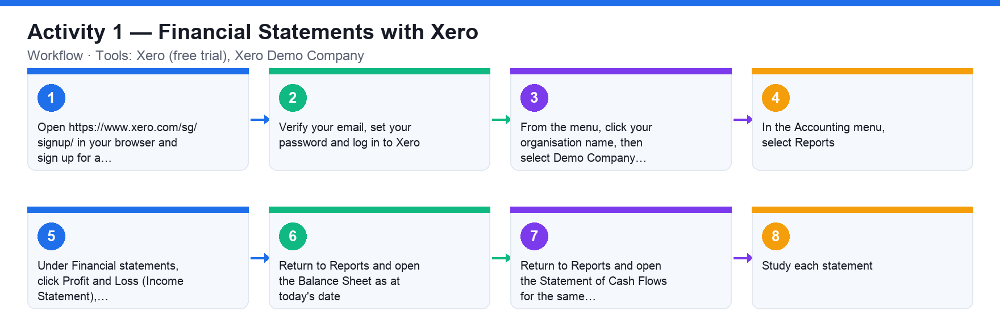

# Activity 1 — Financial Statements with Xero

**Course:** WSQ Budgeting for Small and Medium Enterprises (TGS-2021002336)  
**Topic 01:** Introduction to Financial Budgeting  
**Learning outcome:** LO1 — Analyse business strategies and objectives (A1, K1)  
**Tools:** Xero (free trial), Xero Demo Company

## Goal

Sign up for a free Xero account, open the demo company with fictional data, and generate the three financial statements a budget is expressed through.

## What you'll produce

The Income Statement, Balance Sheet and Cash Flow Statement of the Xero demo company.

## Step-by-step

1. Open https://www.xero.com/sg/signup/ in your browser and sign up for a free Xero account with your email address.
2. Verify your email, set your password and log in to Xero.
3. From the menu, click your organisation name, then select Demo Company to switch into the demo organisation with fictional data.
4. In the Accounting menu, select Reports.
5. Under Financial statements, click Profit and Loss (Income Statement), set the date range to the current financial year and click Update.
6. Return to Reports and open the Balance Sheet as at today's date.
7. Return to Reports and open the Statement of Cash Flows for the same period.
8. Study each statement: identify Revenue, Cost of Goods Sold and SG&A on the P&L; Assets, Liabilities and Equity on the Balance Sheet; and operating, investing and financing cash flows on the Cash Flow Statement.

## Data files (in this folder)

- [`activity-01-financial-statements.xlsx`](activity-01-financial-statements.xlsx) — GreenLeaf Trading Pte Ltd — Income Statement, Balance Sheet and Cash Flow sheets with live formulas.
- [`activity-01-income-statement.csv`](activity-01-income-statement.csv) — The Income Statement as plain data (Line Item, Amount).
- [`activity-01-balance-sheet.csv`](activity-01-balance-sheet.csv) — The Balance Sheet as plain data.
- [`activity-01-cash-flow.csv`](activity-01-cash-flow.csv) — The Cash Flow Statement as plain data.

## Analyzing the Excel workbook — step by step

1. Open activities/activity01/activity-01-financial-statements.xlsx in Excel (or Google Sheets / LibreOffice). It has three sheets — Income Statement, Balance Sheet and Cash Flow — mirroring the three statements you generated in Xero.
2. On the Income Statement sheet, click cell B6 (Total Revenue) and read the formula bar: =SUM(B4:B5). Blue numbers are inputs; black numbers are formulas — never overtype a black cell.
3. Trace the P&L structure downwards: Total Revenue − Total COGS = Gross Profit (B10); Gross Profit − Total SG&A = Operating Profit; then Interest, Tax (17%) and Net Profit. Click each bold cell and confirm its formula matches the story.
4. Read the two ratio cells at the bottom: Gross Profit Margin = Gross Profit ÷ Total Revenue (62.1%) and Net Profit Margin (21.4%). Change Marketing to 88,000 and watch Operating Profit, Tax, Net Profit and both margins recalculate; press Ctrl+Z to undo.
5. On the Balance Sheet sheet, verify TOTAL ASSETS (770,000) = Total Current Assets + Net PP&E, and that the Balance Check cell at the bottom shows 0 — Assets − Liabilities − Equity must always be zero. If you ever edit an input and the check is non-zero, the statement no longer balances.
6. On the Cash Flow sheet, follow the three sections: Operating (Net Profit + Depreciation ± working-capital movements = 254,470), Investing (−80,000 CAPEX) and Financing (−70,000). Confirm Closing Cash (185,000) equals the Cash and Bank line on the Balance Sheet — the statements tie.
7. Compare each sheet with the same statement you generated from the Xero demo company: identify where Revenue, COGS, Assets, Liabilities, Equity and the operating/investing/financing sections appear in both.

## Analyzing the CSV data — step by step

1. Open activities/activity01/activity-01-income-statement.csv in a text editor first — see that a CSV is just comma-separated rows with a header line (Line Item, Amount). This is the format accounting systems export.
2. Import it into a blank spreadsheet (Excel: Data → Get Data → From Text/CSV; Google Sheets: File → Import → Upload). Confirm the Amount column imported as numbers, not text.
3. The CSV carries values only — no formulas. Rebuild the checks yourself: in a spare cell compute Gross Profit = Total Revenue − Total COGS with a SUM/lookup, and confirm you get 745,000, matching the Excel workbook.
4. Import activity-01-balance-sheet.csv the same way and verify TOTAL ASSETS (770,000) = TOTAL LIABILITIES (348,000) + TOTAL EQUITY (422,000) with a formula.
5. Import activity-01-cash-flow.csv and verify Opening Cash + Net Change in Cash = Closing Cash (80,530 + 104,470 = 185,000).

## Check your work

You can display all three statements for the Xero demo company and point out where revenue, COGS, assets, liabilities, equity and net cash movement appear on each.
