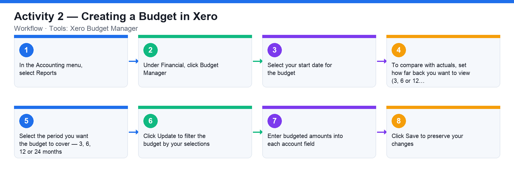

# Activity 2 — Creating a Budget in Xero

**Course:** WSQ Budgeting for Small and Medium Enterprises (TGS-2021002336)  
**Topic 01:** Introduction to Financial Budgeting  
**Learning outcome:** LO1 — Analyse business strategies and objectives (A1, K1)  
**Tools:** Xero Budget Manager

## Goal

Use Xero's Budget Manager to create a budget for the demo company, comparing budgeted amounts against actuals.

## What you'll produce

A 12-month budget in Xero Budget Manager with budgeted amounts entered for key P&L accounts.

## Step-by-step

1. In the Accounting menu, select Reports.
2. Under Financial, click Budget Manager.
3. Select your start date for the budget.
4. To compare with actuals, set how far back you want to view (3, 6 or 12 months). Select 'None' if you don't want to view actuals.
5. Select the period you want the budget to cover — 3, 6, 12 or 24 months.
6. Click Update to filter the budget by your selections.
7. Enter budgeted amounts into each account field. Use a simple formula with the green arrows to fill out the months (e.g. apply a fixed amount or a % increase per month).
8. Click Save to preserve your changes.

## Data files (in this folder)

- [`activity-02-budget-plan.xlsx`](activity-02-budget-plan.xlsx) — FY2026 12-month budget plan — Sales grows 2%/month; commission, discount and direct costs are live %-of-sales formulas.
- [`activity-02-budget-plan.csv`](activity-02-budget-plan.csv) — The same budget as plain data, one row per account, Jan–Dec + Total.

## Analyzing the Excel workbook — step by step

1. Open activities/activity02/activity-02-budget-plan.xlsx. Row 2 holds the three driver rates in blue — Commission 5%, Discount 2%, Direct Costs 55%. Rows 5–14 are the account lines across Jan–Dec with a Total column.
2. Click any Sales Commission cell (row 6) and read its formula, e.g. =B5*$C$2 — commission is derived from Sales via an absolute reference to the rate cell. This is why you budget drivers, not hardcoded numbers.
3. Click the Total column (column N): every account totals with =SUM(B..M). Confirm Sales totals 1,207,085 for the year.
4. Read the Net Surplus row: each month = Sales − all expense rows. Check which months are surplus and which are deficit.
5. Test the model: change the Direct Costs rate (G2) from 55% to 60% and watch every month's Direct Costs and Net Surplus recalculate. Undo (Ctrl+Z).
6. Now enter this budget into Xero Budget Manager (Accounting → Reports → Budget Manager): create a 12-month budget and key the monthly figures for each account — use the green-arrow fill with a 2% monthly increase for Sales instead of typing all 12 cells.
7. Save in Xero, then cross-check: the Xero budget's annual total for Sales must equal the workbook's Total cell.

## Analyzing the CSV data — step by step

1. Open activities/activity02/activity-02-budget-plan.csv in a text editor — one row per account, columns Jan–Dec plus Total, values only.
2. Import it into a blank spreadsheet. Add a check column: =SUM(B2:M2) beside the imported Total and confirm they agree for every account — this is how you validate someone else's exported budget.
3. Compute the commission rate implied by the data: Sales Commission Total ÷ Sales Total ≈ 5%. Because a CSV has no formulas, recomputing the driver rates is how you reverse-engineer the assumptions.
4. Use this CSV as your data-entry source when keying the budget into Xero Budget Manager if you prefer working from a printed sheet.

## Check your work

Your saved budget shows 12 months of budgeted figures for revenue and expense accounts, and Budget Manager displays actuals alongside the budget for comparison.
