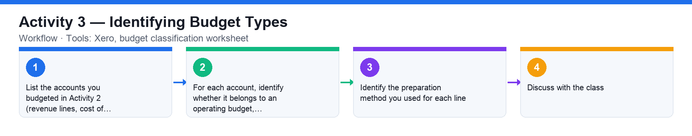

# Activity 3 — Identifying Budget Types

**Course:** WSQ Budgeting for Small and Medium Enterprises (TGS-2021002336)  
**Topic 01:** Introduction to Financial Budgeting  
**Learning outcome:** LO1 — Analyse business strategies and objectives (A1, K1)  
**Tools:** Xero, budget classification worksheet

## Goal

Classify the budgets you built in Xero against the classification of budgets — operating, financial, capital and cash — and the preparation methods (baseline, incremental, zero-based, hybrid).

## What you'll produce

A completed budget-type classification table for the parameters used in the previous Xero activities.

## Step-by-step

1. List the accounts you budgeted in Activity 2 (revenue lines, cost of sales, SG&A expenses, capital items).
2. For each account, identify whether it belongs to an operating budget, financial budget, capital budget or cash budget.
3. Identify the preparation method you used for each line: baseline (previous plan), incremental (% or $ on the baseline), zero-based (fresh) or hybrid.
4. Discuss with the class: which budget type and method fits an SME's sales budget, rental expense and new-equipment purchase, and why.

## Data files (in this folder)

- [`activity-03-budget-classification.xlsx`](activity-03-budget-classification.xlsx) — 12 spending items to classify — yellow Budget Type and Preparation Method columns to fill; a Reference sheet defines every term.
- [`activity-03-budget-classification.csv`](activity-03-budget-classification.csv) — The same worksheet as plain data with empty classification columns.

## Analyzing the Excel workbook — step by step

1. Open activities/activity03/activity-03-budget-classification.xlsx on the Worksheet sheet — 12 real spending items with their annual amounts. The yellow cells are yours to fill.
2. Open the Reference sheet and read the definitions: Operating / Cash / Capital / Financial budget types, and Baseline / Incremental / Zero-based / Hybrid preparation methods.
3. For each item, fill Budget Type: e.g. 'Monthly office rental' → Operating; 'New delivery van purchase' → Capital; 'Cash float for retail outlets' → Cash; 'Bank loan repayment' and 'Dividend payout' → Financial.
4. Fill Preparation Method for each: rent is a Baseline carry-forward; salaries are typically Incremental; a brand-new POS system is Zero-based; raw materials may be Hybrid (baseline volume × new prices). Be ready to justify each choice.
5. Add a summary: in a spare cell use =COUNTIF(C5:C16,"Operating") (and repeat for the other types) to count how many items fall in each budget type.
6. Compare your classification with a neighbour and defend any differences using the Reference definitions — several items have more than one defensible method.

## Analyzing the CSV data — step by step

1. Open activities/activity03/activity-03-budget-classification.csv in a text editor to see the raw worksheet — the two classification columns are empty strings.
2. Import into a spreadsheet, fill the two columns as above, then File → Save As / Download as CSV to practise round-tripping data: open your saved CSV again and confirm your classifications survived.
3. Sort the imported data by your Budget Type column to group items and check each group's total annual amount with SUMIF.

## Check your work

You can name the budget type and preparation method for every parameter in your Xero budget and justify the classification.
