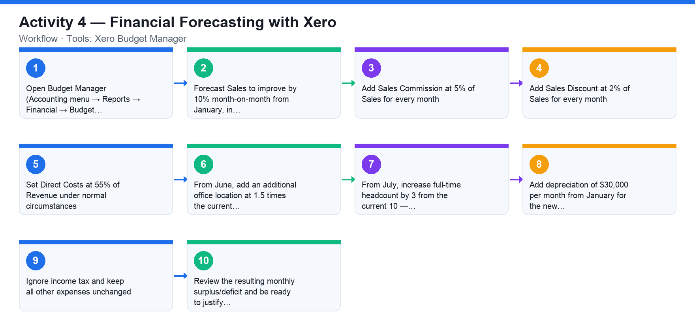

# Activity 4 — Financial Forecasting with Xero

**Course:** WSQ Budgeting for Small and Medium Enterprises (TGS-2021002336)  
**Topic 02:** Financial Forecasting  
**Learning outcome:** LO2 — Carry out financial forecasting (A2, K2)  
**Tools:** Xero Budget Manager

## Goal

Use Xero's Budget Manager to perform a full financial forecast for the coming year from a set of business assumptions, choosing and justifying your budgeting methods.

## What you'll produce

A 12-month financial forecast in Xero Budget Manager reflecting all given sales, cost, headcount and capex assumptions.

## Step-by-step

1. Open Budget Manager (Accounting menu → Reports → Financial → Budget Manager) and start a new 12-month budget for the coming financial year.
2. Forecast Sales to improve by 10% month-on-month from January, in comparison to the same month last year.
3. Add Sales Commission at 5% of Sales for every month.
4. Add Sales Discount at 2% of Sales for every month.
5. Set Direct Costs at 55% of Revenue under normal circumstances.
6. From June, add an additional office location at 1.5 times the current office rental.
7. From July, increase full-time headcount by 3 from the current 10 — scale salary expense accordingly.
8. Add depreciation of $30,000 per month from January for the new capital-expenditure projects.
9. Ignore income tax and keep all other expenses unchanged. Save the budget.
10. Review the resulting monthly surplus/deficit and be ready to justify which budgeting method (baseline, incremental, zero-based or hybrid) you applied to each line.

## Data files (in this folder)

- [`activity-04-fy2025-actuals.xlsx`](activity-04-fy2025-actuals.xlsx) — FY2025 monthly actuals (the forecast baseline) plus a yellow Forecast Assumptions sheet holding every FY2026 assumption.
- [`activity-04-fy2025-actuals.csv`](activity-04-fy2025-actuals.csv) — The FY2025 actuals as plain data, Jan–Dec + Total per account.

## Analyzing the Excel workbook — step by step

1. Open activities/activity04/activity-04-fy2025-actuals.xlsx. The FY2025 Actuals sheet is your baseline: Sales grew about 1.5%/month from 75,000; commission 5%, discount 2%, direct costs 55%; rent 7,500; salaries 45,000 (10 staff); depreciation 12,000; other 5,000.
2. Open the Forecast Assumptions sheet — the yellow cells hold every FY2026 assumption from the activity: +10% sales vs the same month last year, 5% commission, 2% discount, 55% direct costs, an extra office at 1.5× rent from June, +3 headcount at 4,500/month from July, and 30,000/month depreciation from January. Income tax is ignored.
3. Build the FY2026 forecast: add a new sheet (or columns) and for January compute Sales = Jan FY2025 × (1+10%); copy across all 12 months.
4. Derive the dependent lines with formulas referencing the assumption cells: Commission = Sales × 5%, Discount = Sales × 2%, Direct Costs = Sales × 55%.
5. Handle the step changes with IF or by splitting the year: Rent = 7,500 until May, then 7,500 × (1 + 1.5) from June (current office plus the new one at 1.5×); Salaries = 45,000 until June, then (10+3) × 4,500 = 58,500 from July; Depreciation = 12,000 + 30,000 = 42,000 every month.
6. Add a Net Surplus row = Sales − all expense lines and total the year. Identify which months turn negative after the June/July step-ups and what that means for cash planning.
7. Now reproduce the same forecast in Xero Budget Manager, using the workbook as your working: the Xero monthly figures must match your sheet. Be ready to justify which budgeting method (baseline / incremental / zero-based / hybrid) you applied to each line.

## Analyzing the CSV data — step by step

1. Import activities/activity04/activity-04-fy2025-actuals.csv into a blank spreadsheet — this is the same baseline without any formulas, as a finance system would export it.
2. Verify the baseline before forecasting from it: recompute one derived line (e.g. Jan Commission ÷ Jan Sales = 5%) to confirm the data is internally consistent.
3. Build the FY2026 forecast columns beside the imported data using the same assumption formulas as the Excel walkthrough — starting from a values-only CSV is the realistic case, since exports never carry formulas.

## Check your work

Your Budget Manager forecast reflects every assumption (10% MoM sales growth, 5% commission, 2% discount, 55% direct costs, new office from June, +3 headcount from July, $30k/month depreciation) and you can justify the method used for each line.
