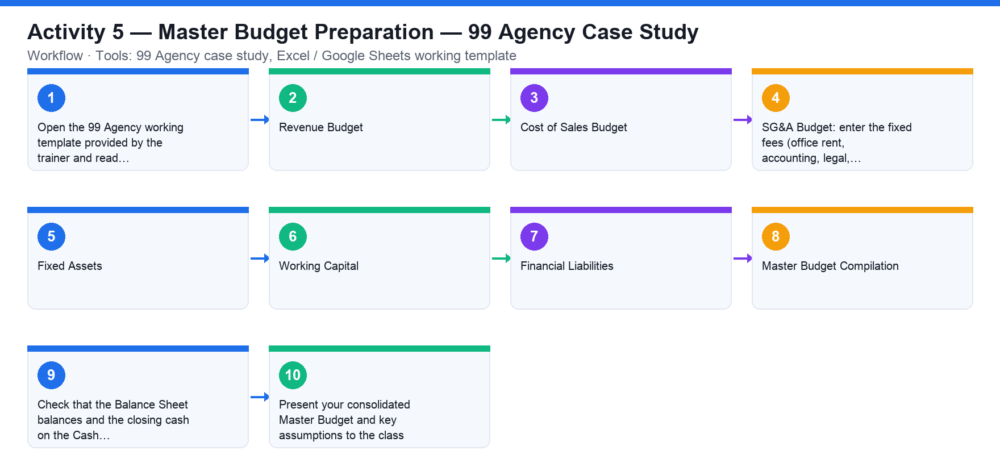

# Activity 5 — Master Budget Preparation — 99 Agency Case Study

**Course:** WSQ Budgeting for Small and Medium Enterprises (TGS-2021002336)  
**Topic 03:** Budget Preparation  
**Learning outcome:** LO3 — Prepare budget to meet cash flow requirements (A3, K3, K4)  
**Tools:** 99 Agency case study, Excel / Google Sheets working template

## Goal

Prepare a one-year Master Budget (Income Statement, Balance Sheet and Cash Flow Statement) for the fictitious company 99 Agency, working through the seven budget schedules on the provided template.

## What you'll produce

A complete Master Budget for 99 Agency — P&L, Balance Sheet and Cash Flow — consolidated from the seven schedules and presented to the class.

## Step-by-step

1. Open the 99 Agency working template provided by the trainer and read the case background: the company's operations, revenue forecast, cost of SEO and ads, and the key assumptions.
2. STEP 1 — Revenue Budget: build the 12-month revenue forecast using the bottom-up approach with company-specific parameters, and the top-down approach for the long-term view.
3. STEP 2 — Cost of Sales Budget: budget the ad-campaign and SEO-campaign costs using the baseline budget and averaging method.
4. STEP 3 — SG&A Budget: enter the fixed fees (office rent, accounting, legal, staff training, management salaries, administration) and the %-of-revenue lines (external services, selling commissions).
5. STEP 4 — Fixed Assets: schedule property, plant & equipment additions and compute monthly depreciation.
6. STEP 5 — Working Capital: compute current assets minus current liabilities, using the working-capital-days assumptions for receivables, payables and inventory.
7. STEP 6 — Financial Liabilities: schedule the loan balances and interest expense at the given interest rate.
8. STEP 7 — Master Budget Compilation: consolidate all schedules into the budgeted Income Statement, Balance Sheet and Cash Flow Statement.
9. Check that the Balance Sheet balances and the closing cash on the Cash Flow ties to the Balance Sheet cash.
10. Present your consolidated Master Budget and key assumptions to the class.

## Data files (in this folder)

- [`activity-05-99-agency-template.xlsx`](activity-05-99-agency-template.xlsx) — The 99 Agency master-budget working template — Assumptions, Revenue and Cost of Sales schedules pre-wired; SG&A, Fixed Assets, Working Capital, Liabilities and Master Budget sheets to build.
- [`activity-05-client-baseline.csv`](activity-05-client-baseline.csv) — Per-client FY2025 revenue and expected FY2026 growth (the bottom-up input).
- [`activity-05-assumptions.csv`](activity-05-assumptions.csv) — Every case assumption as plain data.

## Analyzing the Excel workbook — step by step

1. Open activities/activity05/activity-05-99-agency-template.xlsx. The Assumptions sheet holds every case parameter in blue — market size 12m × 12% share, cost-of-sales rates, fixed and variable SG&A, quarterly CAPEX (40k/60k/25k/80k), 10% depreciation on beginning fixed assets of 400k, liabilities falling from 3.2m to 2.8m at 5% interest, and AR/AP days.
2. STEP 1 — open the '1 Revenue' sheet. The bottom-up plan is pre-wired: each client's FY2026 revenue = FY2025 × (1 + growth) — click D4 and read =B4*(1+C4). The top-down target pulls from the Assumptions sheet (=Assumptions!B4*Assumptions!B5 = 1,440,000), and the yellow committee cell takes the AVERAGE of bottom-up and top-down. Confirm the bottom-up total is 1,534,800 and the committee target 1,487,400.
3. STEP 2 — open '2 Cost of Sales': revenue is split 60% Ad / 40% SEO, and each stream is costed at its Assumptions rate (30% / 25%). Trace each formula back to the sheets it references — this is the baseline + averaging method from the slides.
4. STEP 3 — build the '3 SGA' sheet: list the six fixed fees from Assumptions (rent 60k, accounting 12k, legal 8k, training 10k, management salaries 180k, admin 24k), then add the two variable lines = committee revenue × 4% (external services) and × 3% (selling commissions). Total the SG&A.
5. STEP 4 — build '4 Fixed Assets': beginning fixed assets 400,000 + the four quarterly CAPEX amounts = closing gross assets 605,000; depreciation = 10% × beginning fixed assets = 40,000; closing net assets = closing gross − accumulated depreciation.
6. STEP 5 — build '5 Working Capital': Accounts Receivable = committee revenue × 45/365; Accounts Payable = total cost of sales × 30/365. Working capital = AR − AP.
7. STEP 6 — build '6 Liabilities': beginning 3,200,000, ending 2,800,000 (repayment 400,000); interest expense = 5% × average balance ( (3.2m+2.8m)/2 × 5% = 150,000 ).
8. STEP 7 — build '7 Master Budget': compile the Income Statement (committee revenue − cost of sales − SG&A − depreciation − interest = net profit), then the Balance Sheet (net fixed assets, AR, cash; liabilities and equity with retained earnings up by net profit) and the Cash Flow. Check: the Balance Sheet balances and closing cash ties to the Cash Flow.
9. Present your consolidated Master Budget: show the committee revenue decision, the schedule totals and the final three statements.

## Analyzing the CSV data — step by step

1. Open activities/activity05/activity-05-client-baseline.csv — the raw bottom-up input: five client rows with FY2025 revenue and expected growth. Import it into a blank sheet and recompute the bottom-up total (Σ revenue × (1+growth)) = 1,534,800 to verify it matches the template.
2. Open activities/activity05/activity-05-assumptions.csv — every assumption as data. Use it as your checklist while building STEP 3–7: tick each assumption off as your schedules consume it; an unused assumption means a schedule is incomplete.
3. If you prefer building from scratch, import both CSVs into one workbook and construct the whole 7-schedule model from the raw data instead of the pre-wired template — the totals must come out identical.

## Check your work

Your 99 Agency Master Budget consolidates all seven schedules; the Balance Sheet balances, closing cash ties across statements, and you presented the budget with its assumptions.
