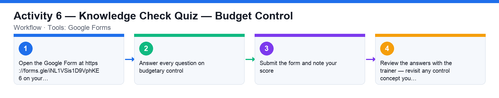

# Activity 6 — Knowledge Check Quiz — Budget Control

**Course:** WSQ Budgeting for Small and Medium Enterprises (TGS-2021002336)  
**Topic 04:** Budget Control Plan  
**Learning outcome:** LO4 — Prepare budget control plan (A4, K5, K7)  
**Tools:** Google Forms

## Goal

Check your understanding of budgetary control — the control types, the control process steps and the budget process road map — with an online quiz.

## What you'll produce

A submitted quiz on budget control with your score reviewed against the class.

## Step-by-step

1. Open the Google Form at https://forms.gle/iNL1VSis1D9VphKE6 on your laptop or phone.
2. Answer every question on budgetary control: the control process steps, operating vs cash-flow vs capital-expenditure control, and the budget process road map.
3. Submit the form and note your score.
4. Review the answers with the trainer — revisit any control concept you missed.

## Data files (in this folder)

- [`activity-06-budget-control-monitor.xlsx`](activity-06-budget-control-monitor.xlsx) — Six departments' mid-year budget vs actual with live variance, variance-% and a REVIEW/OK status driven by a 10% threshold cell.
- [`activity-06-budget-control-monitor.csv`](activity-06-budget-control-monitor.csv) — The same monitor as plain data (no formulas) for you to rebuild.

## Analyzing the Excel workbook — step by step

1. Open activities/activity06/activity-06-budget-control-monitor.xlsx before attempting the quiz — it makes the control-loop concepts concrete.
2. Read row by row: each department has an Annual Budget, YTD Budget and YTD Actual. Variance = Actual − Budget (=D5-C5) and Var % = Variance ÷ YTD Budget.
3. Click a Status cell and read the control formula: =IF(ABS(F5)>$B$2,"REVIEW","OK") — any department whose absolute variance % exceeds the yellow threshold cell (10%) is flagged for corrective action. This IS budgetary control: compare, investigate, correct.
4. Identify the flagged departments (Marketing overspend ≈ +19%, Operations ≈ +9%) and, for each, say which control applies — operating, cash flow or capital-expenditure control — and what corrective action you would take.
5. Change the threshold from 10% to 5% and watch more departments flip to REVIEW — thresholds decide how much management attention the process demands. Undo when done.
6. Now take the Google Form quiz; use the workbook to reason about the control-process questions.

## Analyzing the CSV data — step by step

1. Import activities/activity06/activity-06-budget-control-monitor.csv into a blank spreadsheet — it has only the three data columns per department.
2. Rebuild the monitor yourself: add Variance, Var % and Status columns with the formulas from the Excel walkthrough. Getting the IF/ABS threshold formula right is the point of the exercise.
3. Check your rebuilt monitor flags exactly the same departments as the workbook.

## Check your work

You submitted the quiz and can explain any question you got wrong — especially the three types of budget control and the corrective-action loop.
