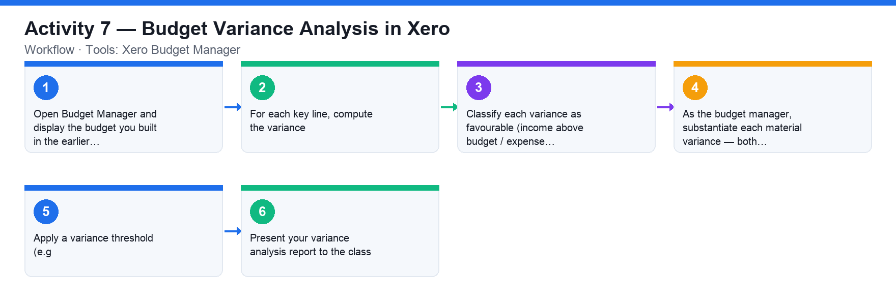

# Activity 7 — Budget Variance Analysis in Xero

**Course:** WSQ Budgeting for Small and Medium Enterprises (TGS-2021002336)  
**Topic 05:** Budget Analysis  
**Learning outcome:** LO5 — Perform financial analysis to highlight discrepancies (A5, K8, K9)  
**Tools:** Xero Budget Manager

## Goal

Compare your Xero budget against actual performance, identify favourable and adverse variances, substantiate them as a budget manager and present the analysis.

## What you'll produce

A budget-to-actual variance analysis report identifying and substantiating favourable and adverse variances, presented to the class.

## Step-by-step

1. Open Budget Manager and display the budget you built in the earlier activity alongside actuals (set the actuals comparison to 3, 6 or 12 months).
2. For each key line, compute the variance: actual minus budget, in dollars and as a percentage of budget.
3. Classify each variance as favourable (income above budget / expense below budget) or adverse (income below budget / expense above budget).
4. As the budget manager, substantiate each material variance — both favourable and adverse: what business events explain it?
5. Apply a variance threshold (e.g. ±10% or ±$5,000) to decide which variances need management action.
6. Present your variance analysis report to the class.

## Data files (in this folder)

- [`activity-07-budget-vs-actual.xlsx`](activity-07-budget-vs-actual.xlsx) — Budget and Actual sheets (8 accounts × 12 months) plus a Variance sheet that classifies every line Favourable/Adverse against a threshold.
- [`activity-07-budget.csv`](activity-07-budget.csv) — The budget as plain data.
- [`activity-07-actual.csv`](activity-07-actual.csv) — The actuals as plain data.

## Analyzing the Excel workbook — step by step

1. Open activities/activity07/activity-07-budget-vs-actual.xlsx. The Budget and Actual sheets hold the same 8 accounts across Jan–Dec; actuals deviate from budget (Sales ran ~3% under, Marketing ~28% over, Direct Costs ~4% over…).
2. Open the Variance sheet: Budget and Actual totals are pulled cross-sheet (=Budget!N4, =Actual!N4 — green-style links), Variance = Actual − Budget, Var % = Variance ÷ Budget.
3. Study the Classification formula: for an income account a positive variance is Favourable; for an expense account a NEGATIVE variance is Favourable — click G5 and read the nested IF that encodes this. This distinction is the heart of variance analysis.
4. Identify every Adverse line above the 10% threshold (Marketing +28%) and every Favourable one (Other Expenses −8%). Substantiate each as the budget manager: what business events explain it?
5. Sales is under budget by ~3% — express the variance in dollars AND as a % (the Budget-to-Actual report style from the slides: e.g. budget 500,000, actual 400,000 → (100,000) and (20%)).
6. Reproduce the same analysis in Xero: display your Budget Manager budget alongside actuals, and compare Xero's variance columns with the workbook's.
7. Write your variance analysis report: each material variance, its classification, substantiation, and the corrective action — then present it to the class.

## Analyzing the CSV data — step by step

1. Import both activities/activity07/activity-07-budget.csv and activities/activity07/activity-07-actual.csv into ONE spreadsheet on two sheets — this simulates receiving separate system exports.
2. Build your own Variance sheet from scratch: reference the two imported sheets, compute Variance and Var %, and add the income-vs-expense Favourable/Adverse IF formula.
3. Cross-check your computed variances against the workbook's Variance sheet — every figure must match. If one differs, find whether your cross-sheet reference points at the wrong row (the classic variance-report bug).

## Check your work

Your report shows dollar and percentage variances for each key account, labels each as favourable or adverse, substantiates the material ones, and was presented to the class.
