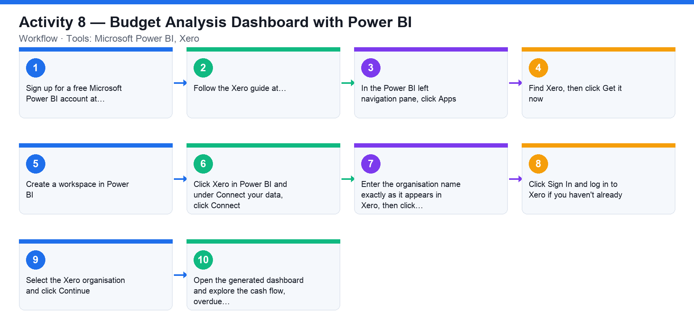

# Activity 8 — Budget Analysis Dashboard with Power BI

**Course:** WSQ Budgeting for Small and Medium Enterprises (TGS-2021002336)  
**Topic 05:** Budget Analysis  
**Learning outcome:** LO5 — Perform financial analysis to highlight discrepancies (A5, K8, K9)  
**Tools:** Microsoft Power BI, Xero

## Goal

Connect Microsoft Power BI to your Xero organisation and build a dashboard that analyses cash flow, overdue invoices and bills, and profitability.

## What you'll produce

A Power BI dashboard fed daily from Xero contacts, invoices, bills and trial balance.

## Step-by-step

1. Sign up for a free Microsoft Power BI account at https://powerbi.microsoft.com/en-us/landing/signin/ (a Pro trial is sufficient).
2. Follow the Xero guide at https://central.xero.com/s/article/Microsoft-Power-Bi#Connectyourorganisation.
3. In the Power BI left navigation pane, click Apps.
4. Find Xero, then click Get it now.
5. Create a workspace in Power BI.
6. Click Xero in Power BI and under Connect your data, click Connect.
7. Enter the organisation name exactly as it appears in Xero, then click Next.
8. Click Sign In and log in to Xero if you haven't already.
9. Select the Xero organisation and click Continue.
10. Open the generated dashboard and explore the cash flow, overdue invoices/bills and profitability visuals.

## Data files (in this folder)

- [`activity-08-xero-export.xlsx`](activity-08-xero-export.xlsx) — A Xero-style export: 60 sales invoices, 48 supplier bills and a balanced trial balance.
- [`activity-08-invoices.csv`](activity-08-invoices.csv) — The invoices as CSV — ready to load into Power BI.
- [`activity-08-bills.csv`](activity-08-bills.csv) — The bills as CSV.
- [`activity-08-trial-balance.csv`](activity-08-trial-balance.csv) — The trial balance as CSV.

## Analyzing the Excel workbook — step by step

1. Open activities/activity08/activity-08-xero-export.xlsx. The Invoices sheet lists six months of sales invoices (number, date, due date, contact, amount, amount paid, status); Bills is the supplier side; Trial Balance is the account-level position.
2. On Invoices, read the Total and Outstanding cells below the table: Outstanding = total invoiced − total paid — this is the receivables exposure a cash-flow dashboard must show.
3. Analyse receivables: insert a PivotTable (Insert → PivotTable) with Contact on rows and Amount − Amount Paid as values to rank customers by outstanding balance; filter Status = Authorised to isolate unpaid invoices.
4. Repeat on Bills for payables: which suppliers are owed the most, and in which months do payments cluster?
5. On Trial Balance, confirm the Balance check cell equals 0 (total debits = total credits, 1,442,000 each side) — an unbalanced TB means the export is corrupt. Identify which accounts are P&L (Sales, COGS, expenses) and which are Balance Sheet.
6. From the TB compute profitability in spare cells: Sales − COGS − expenses = operating result; compare gross margin with Activity 1.
7. In Power BI Desktop (or the Power BI service), use Get Data → Excel workbook to load all three sheets and build three visuals: outstanding receivables by contact (bar), monthly invoiced vs paid (line), and expenses breakdown from the TB (donut). This mirrors what the Xero connector builds automatically.

## Analyzing the CSV data — step by step

1. The three CSVs are the same tables as system exports. In Power BI: Get Data → Text/CSV, load activity-08-invoices.csv, activity-08-bills.csv and activity-08-trial-balance.csv — use this route whenever the live Xero connector is unavailable in class.
2. In Power Query, check each column's data type (dates as Date, amounts as Decimal Number) before loading — CSV imports default to text when a type is ambiguous, and a text amount cannot be summed.
3. Add a computed column Outstanding = Amount − [Amount Paid] on invoices, then build the same three visuals as the Excel walkthrough.
4. Cross-check one number between the two routes: total outstanding receivables from your CSV-based dashboard must equal the workbook's Outstanding cell.

## Check your work

Power BI displays the Xero dashboard for your organisation and you can read off cash-flow, receivables and profitability insights that support budget analysis.
