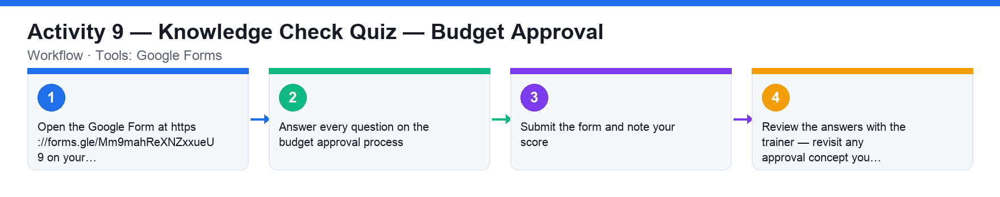

# Activity 9 — Knowledge Check Quiz — Budget Approval

**Course:** WSQ Budgeting for Small and Medium Enterprises (TGS-2021002336)  
**Topic 06:** Budget Approval  
**Learning outcome:** LO6 — Report budget and seek approval (A6, K10)  
**Tools:** Google Forms

## Goal

Check your understanding of the budget approval process, the stakeholder precautions and the common approval issues with an online quiz.

## What you'll produce

A submitted quiz on budget approval with your score reviewed against the class.

## Step-by-step

1. Open the Google Form at https://forms.gle/Mm9mahReXNZxxueU9 on your laptop or phone.
2. Answer every question on the budget approval process: the approval steps, the stakeholder precautions (past-year review, goals, forecast, plan details, costs) and the common issues.
3. Submit the form and note your score.
4. Review the answers with the trainer — revisit any approval concept you missed.

## Data files (in this folder)

- [`activity-09-approval-pack.xlsx`](activity-09-approval-pack.xlsx) — Six departmental FY2027 budget submissions with growth-% formulas and an HQ growth-cap check.
- [`activity-09-approval-pack.csv`](activity-09-approval-pack.csv) — The submissions as plain data.

## Analyzing the Excel workbook — step by step

1. Open activities/activity09/activity-09-approval-pack.xlsx before the quiz — it walks the approval process with real numbers.
2. Each department row shows FY2026 Actual, FY2027 Requested and a Growth % formula. The yellow cell holds the HQ cap: the total ask may grow at most 8% over prior year.
3. Read the bottom check: total requested vs total actual → the 'Within HQ cap?' cell. The total ask (1,308,000 vs 1,124,000 ≈ +16%) exceeds the cap, so the committee must trim — exactly the 'numbers are opened up and re-sold' stage from the slides.
4. Play the budgeting-committee role: decide where to trim to bring the total within 8%, using each department's justification column (protect statutory HR increments; challenge the largest discretionary asks like Marketing +31% and IT +43%).
5. For your trimmed plan, state how you would present it for approval: past-year review, goals, forecast, plan details, realistic costs — the five-part approval pack.
6. Then take the Google Form quiz on budget approval.

## Analyzing the CSV data — step by step

1. Import activities/activity09/activity-09-approval-pack.csv into a spreadsheet and rebuild the pack: add the Growth % column, the totals row and the cap check formula yourself.
2. Sort by your Growth % column descending to produce the committee's challenge list — the order in which requests get questioned.

## Check your work

You submitted the quiz and can walk through the approval pack a budget manager presents — and the common issues that stall approval.
