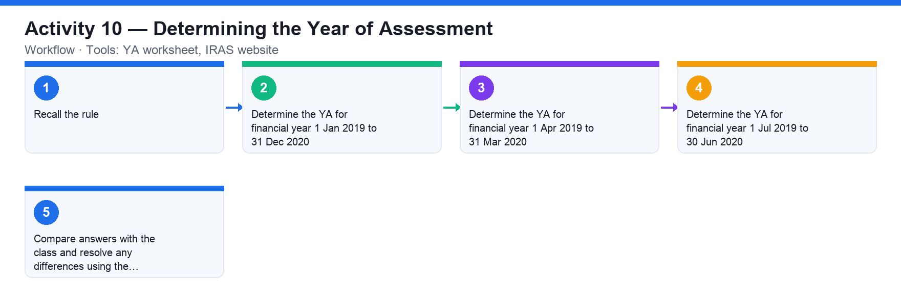

# Activity 10 — Determining the Year of Assessment

**Course:** WSQ Budgeting for Small and Medium Enterprises (TGS-2021002336)  
**Topic 07:** Financial Compliance  
**Learning outcome:** LO7 — Perform financial control to ensure compliance (A7, K6)  
**Tools:** YA worksheet, IRAS website

## Goal

Work out the Year of Assessment (YA) for a set of company financial years, applying IRAS's rule that the YA is the year following the financial year end.

## What you'll produce

A completed YA worksheet mapping each financial year to its Year of Assessment.

## Step-by-step

1. Recall the rule: the YA is the 12-month period in which the company's income is assessed — income earned in a financial year is assessed in the YA that follows the financial year end.
2. Determine the YA for financial year 1 Jan 2019 to 31 Dec 2020.
3. Determine the YA for financial year 1 Apr 2019 to 31 Mar 2020.
4. Determine the YA for financial year 1 Jul 2019 to 30 Jun 2020.
5. Compare answers with the class and resolve any differences using the IRAS definition.

## Data files (in this folder)

- [`activity-10-ya-worksheet.xlsx`](activity-10-ya-worksheet.xlsx) — Five financial years with an empty (yellow) Year of Assessment column.
- [`activity-10-ya-worksheet.csv`](activity-10-ya-worksheet.csv) — The same worksheet as plain data.

## Analyzing the Excel workbook — step by step

1. Open activities/activity10/activity-10-ya-worksheet.xlsx — five financial years, including the three from the slides plus two current ones.
2. Recall the rule: income earned in a financial year is assessed in the YA that follows the financial year END.
3. Fill the yellow YA column for each row: a FY ending 31 Dec 2020 → YA 2021; ending 31 Mar 2020 → YA 2021; ending 30 Jun 2020 → YA 2021; ending 31 Dec 2025 → YA 2026; ending 30 Sep 2025 → YA 2026.
4. For the first row (1 Jan 2019 – 31 Dec 2020, a 24-month first period), note that IRAS attributes the income across two YAs in practice — state the YA for the year end and flag the long-first-period point for discussion.
5. Compare answers with the class and resolve differences against the IRAS definition.

## Analyzing the CSV data — step by step

1. Import activities/activity10/activity-10-ya-worksheet.csv, fill the YA column, and save your completed copy as CSV — submit or compare this file in class.
2. Bonus: derive YA with a formula instead of typing — extract the FY-end year with RIGHT(B2,4) and add 1.

## Check your work

Your worksheet assigns the correct YA to all three financial years (YA 2021, YA 2021 and YA 2021 respectively — the YA following each financial year end).
