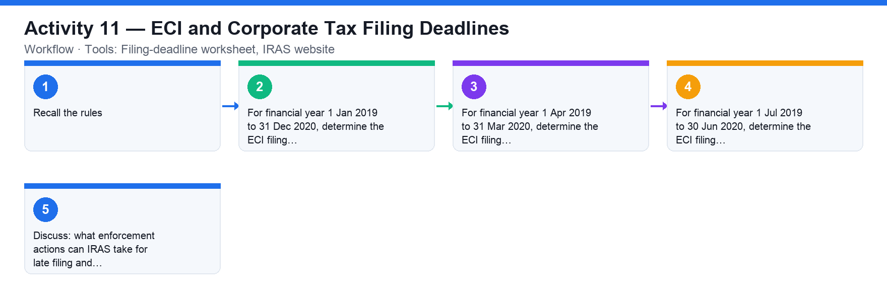

# Activity 11 — ECI and Corporate Tax Filing Deadlines

**Course:** WSQ Budgeting for Small and Medium Enterprises (TGS-2021002336)  
**Topic 07:** Financial Compliance  
**Learning outcome:** LO7 — Perform financial control to ensure compliance (A7, K6)  
**Tools:** Filing-deadline worksheet, IRAS website

## Goal

Determine when a company must file its Estimated Chargeable Income (ECI) and its corporate income tax return for a set of financial year ends.

## What you'll produce

A completed filing-deadline worksheet showing the ECI deadline and income-tax filing deadline for each financial year.

## Step-by-step

1. Recall the rules: ECI must be filed within 3 months of the financial year end; corporate income tax is e-Filed by 30 November (paper filing has been phased out from YA 2020).
2. For financial year 1 Jan 2019 to 31 Dec 2020, determine the ECI filing deadline and the income-tax filing deadline.
3. For financial year 1 Apr 2019 to 31 Mar 2020, determine the ECI filing deadline and the income-tax filing deadline.
4. For financial year 1 Jul 2019 to 30 Jun 2020, determine the ECI filing deadline and the income-tax filing deadline.
5. Discuss: what enforcement actions can IRAS take for late filing and late payment?

## Data files (in this folder)

- [`activity-11-filing-deadlines.xlsx`](activity-11-filing-deadlines.xlsx) — The same five financial years with empty ECI-deadline and corporate-tax e-Filing deadline columns.
- [`activity-11-filing-deadlines.csv`](activity-11-filing-deadlines.csv) — The same worksheet as plain data.

## Analyzing the Excel workbook — step by step

1. Open activities/activity11/activity-11-filing-deadlines.xlsx. Two rules drive everything: ECI is due within 3 months of the financial year end; corporate tax is e-Filed by 30 November (of the YA).
2. Fill the ECI column: FY ending 31 Dec 2020 → ECI by 31 Mar 2021; 31 Mar 2020 → 30 Jun 2020; 30 Jun 2020 → 30 Sep 2020; 31 Dec 2025 → 31 Mar 2026; 30 Sep 2025 → 31 Dec 2025.
3. Fill the e-Filing column: 30 November of each row's YA (from Activity 10) — e.g. YA 2021 → 30 Nov 2021.
4. Optional formula: compute the ECI deadline with EDATE(end_date, 3) on a real date value to see how finance teams automate the compliance calendar.
5. Discuss: what can IRAS do on late filing (prosecution of officers) and late payment (5% penalty + 1%/month up to 12%)?

## Analyzing the CSV data — step by step

1. Import activities/activity11/activity-11-filing-deadlines.csv, complete both deadline columns, and save your answers back to CSV.
2. Sort by ECI deadline to produce the compliance calendar in date order — the view a finance manager pins on the wall.

## Check your work

Your worksheet shows the ECI deadline (FY end + 3 months) and the correct income-tax e-Filing deadline for each financial year, and you can state the late-filing and late-payment penalties.
