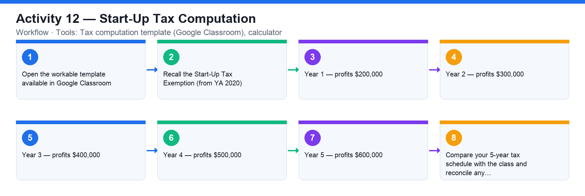

# Activity 12 — Start-Up Tax Computation

**Course:** WSQ Budgeting for Small and Medium Enterprises (TGS-2021002336)  
**Topic 07:** Financial Compliance  
**Learning outcome:** LO7 — Perform financial control to ensure compliance (A7, K6)  
**Tools:** Tax computation template (Google Classroom), calculator

## Goal

Compute the corporate tax payable by a start-up over its first five years of profits, applying the Start-Up Tax Exemption Scheme and the 17% corporate tax rate.

## What you'll produce

A completed 5-year tax computation for a start-up using the provided template.

## Step-by-step

1. Open the workable template available in Google Classroom.
2. Recall the Start-Up Tax Exemption (from YA 2020): for the first 3 YAs — 75% exemption on the first S$100,000 of chargeable income and 50% exemption on the next S$100,000; the corporate tax rate is a flat 17%.
3. Year 1 — profits $200,000: compute the exempt amount, the chargeable income after exemption and the tax at 17%.
4. Year 2 — profits $300,000: repeat the computation (still within the first 3 YAs).
5. Year 3 — profits $400,000: repeat the computation (last start-up-exemption year).
6. Year 4 — profits $500,000: compute tax without the start-up exemption (partial exemption applies from YA 4 onward).
7. Year 5 — profits $600,000: repeat the computation without the start-up exemption.
8. Compare your 5-year tax schedule with the class and reconcile any differences.

## Data files (in this folder)

- [`activity-12-startup-tax.xlsx`](activity-12-startup-tax.xlsx) — Five years of profits with empty exemption / chargeable / tax columns, plus a Rates sheet holding the exemption rules.
- [`activity-12-startup-tax.csv`](activity-12-startup-tax.csv) — The same computation table as plain data.

## Analyzing the Excel workbook — step by step

1. Open activities/activity12/activity-12-startup-tax.xlsx. The Rates sheet holds the rules: 17% flat rate; Start-Up Exemption (first 3 YAs) 75% of the first S$100,000 + 50% of the next S$100,000; from Year 4 the Partial Exemption of 75% of the first S$10,000 + 50% of the next S$190,000.
2. Year 1 (profits 200,000): exempt = 75%×100,000 + 50%×100,000 = 125,000; chargeable = 75,000; tax = 75,000 × 17% = 12,750. Enter these in the yellow cells — with formulas referencing the Rates sheet, not typed numbers.
3. Year 2 (300,000): the exemption only ever covers the first 200,000 of income, so exempt = 125,000; chargeable = 175,000; tax = 29,750.
4. Year 3 (400,000): exempt = 125,000; chargeable = 275,000; tax = 46,750 — the last start-up-exemption year.
5. Year 4 (500,000): switch to the Partial Exemption — exempt = 75%×10,000 + 50%×190,000 = 102,500; chargeable = 397,500; tax = 67,575.
6. Year 5 (600,000): exempt = 102,500; chargeable = 497,500; tax = 84,575.
7. Add a Total row (=SUM of the tax column = 241,400) and a check: effective tax rate per year = tax ÷ profits — watch it climb from 6.4% to 14.1% as the start-up relief expires.

## Analyzing the CSV data — step by step

1. Import activities/activity12/activity-12-startup-tax.csv, rebuild the same computation with formulas, and compare your five tax figures with the class.
2. Save your completed computation as CSV — a values-only copy is what you would attach to a tax working-paper file.

## Check your work

Your template shows, for each of the five years, the exemption applied, the chargeable income after exemption and the tax at 17% — with years 1–3 using the Start-Up Tax Exemption.
