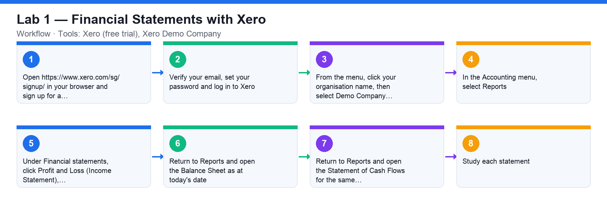

# Lab 1 — Financial Statements with Xero

**Course:** WSQ Budgeting for Small and Medium Enterprises (TGS-2021002336)  
**Topic 01:** Introduction to Financial Budgeting  
**Learning outcome:** LO1 — Analyse business strategies and objectives (A1, K1)  
**Tools:** Xero (free trial), Xero Demo Company

## Goal

Sign up for a free Xero account, open the demo company with fictional data, and generate the three financial statements a budget is expressed through.

## What you'll produce

The Income Statement, Balance Sheet and Cash Flow Statement of the Xero demo company.

## Step-by-step

1. Open https://www.xero.com/sg/signup/ in your browser and sign up for a free Xero account with your email address.
2. Verify your email, set your password and log in to Xero.
3. From the menu, click your organisation name, then select Demo Company to switch into the demo organisation with fictional data.
4. In the Accounting menu, select Reports.
5. Under Financial statements, click Profit and Loss (Income Statement), set the date range to the current financial year and click Update.
6. Return to Reports and open the Balance Sheet as at today's date.
7. Return to Reports and open the Statement of Cash Flows for the same period.
8. Study each statement: identify Revenue, Cost of Goods Sold and SG&A on the P&L; Assets, Liabilities and Equity on the Balance Sheet; and operating, investing and financing cash flows on the Cash Flow Statement.

## Check your work

You can display all three statements for the Xero demo company and point out where revenue, COGS, assets, liabilities, equity and net cash movement appear on each.
