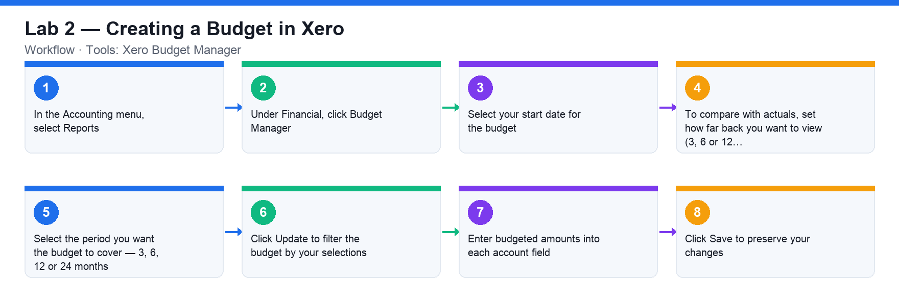

# Lab 2 — Creating a Budget in Xero

**Course:** WSQ Budgeting for Small and Medium Enterprises (TGS-2021002336)  
**Topic 01:** Introduction to Financial Budgeting  
**Learning outcome:** LO1 — Analyse business strategies and objectives (A1, K1)  
**Tools:** Xero Budget Manager

## Goal

Use Xero's Budget Manager to create a budget for the demo company, comparing budgeted amounts against actuals.

## What you'll produce

A 12-month budget in Xero Budget Manager with budgeted amounts entered for key P&L accounts.

## Step-by-step

1. In the Accounting menu, select Reports.
2. Under Financial, click Budget Manager.
3. Select your start date for the budget.
4. To compare with actuals, set how far back you want to view (3, 6 or 12 months). Select 'None' if you don't want to view actuals.
5. Select the period you want the budget to cover — 3, 6, 12 or 24 months.
6. Click Update to filter the budget by your selections.
7. Enter budgeted amounts into each account field. Use a simple formula with the green arrows to fill out the months (e.g. apply a fixed amount or a % increase per month).
8. Click Save to preserve your changes.

## Check your work

Your saved budget shows 12 months of budgeted figures for revenue and expense accounts, and Budget Manager displays actuals alongside the budget for comparison.
