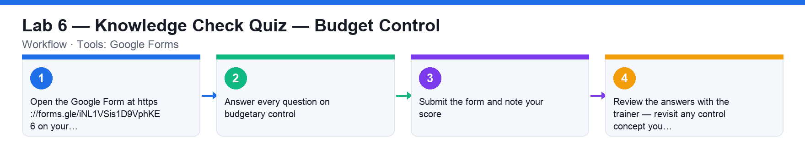

# Lab 6 — Knowledge Check Quiz — Budget Control

**Course:** WSQ Budgeting for Small and Medium Enterprises (TGS-2021002336)  
**Topic 04:** Budget Control Plan  
**Learning outcome:** LO4 — Prepare budget control plan (A4, K5, K7)  
**Tools:** Google Forms

## Goal

Check your understanding of budgetary control — the control types, the control process steps and the budget process road map — with an online quiz.

## What you'll produce

A submitted quiz on budget control with your score reviewed against the class.

## Step-by-step

1. Open the Google Form at https://forms.gle/iNL1VSis1D9VphKE6 on your laptop or phone.
2. Answer every question on budgetary control: the control process steps, operating vs cash-flow vs capital-expenditure control, and the budget process road map.
3. Submit the form and note your score.
4. Review the answers with the trainer — revisit any control concept you missed.

## Check your work

You submitted the quiz and can explain any question you got wrong — especially the three types of budget control and the corrective-action loop.
