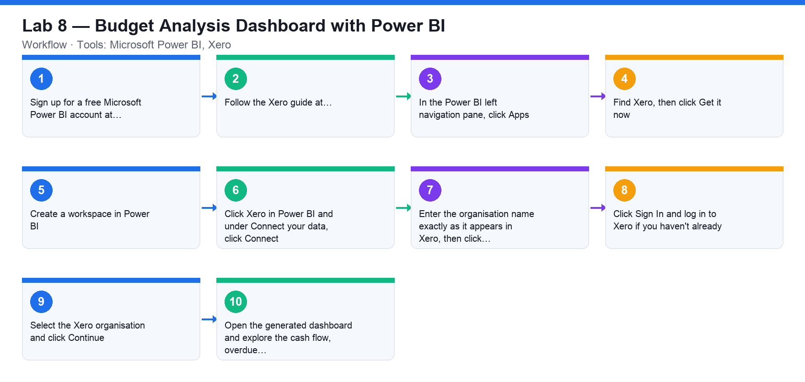

# Lab 8 — Budget Analysis Dashboard with Power BI

**Course:** WSQ Budgeting for Small and Medium Enterprises (TGS-2021002336)  
**Topic 05:** Budget Analysis  
**Learning outcome:** LO5 — Perform financial analysis to highlight discrepancies (A5, K8, K9)  
**Tools:** Microsoft Power BI, Xero

## Goal

Connect Microsoft Power BI to your Xero organisation and build a dashboard that analyses cash flow, overdue invoices and bills, and profitability.

## What you'll produce

A Power BI dashboard fed daily from Xero contacts, invoices, bills and trial balance.

## Step-by-step

1. Sign up for a free Microsoft Power BI account at https://powerbi.microsoft.com/en-us/landing/signin/ (a Pro trial is sufficient).
2. Follow the Xero guide at https://central.xero.com/s/article/Microsoft-Power-Bi#Connectyourorganisation.
3. In the Power BI left navigation pane, click Apps.
4. Find Xero, then click Get it now.
5. Create a workspace in Power BI.
6. Click Xero in Power BI and under Connect your data, click Connect.
7. Enter the organisation name exactly as it appears in Xero, then click Next.
8. Click Sign In and log in to Xero if you haven't already.
9. Select the Xero organisation and click Continue.
10. Open the generated dashboard and explore the cash flow, overdue invoices/bills and profitability visuals.

## Check your work

Power BI displays the Xero dashboard for your organisation and you can read off cash-flow, receivables and profitability insights that support budget analysis.
