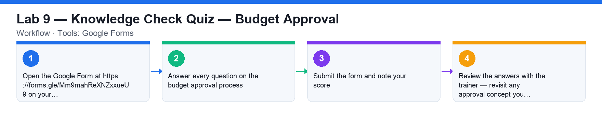

# Lab 9 — Knowledge Check Quiz — Budget Approval

**Course:** WSQ Budgeting for Small and Medium Enterprises (TGS-2021002336)  
**Topic 06:** Budget Approval  
**Learning outcome:** LO6 — Report budget and seek approval (A6, K10)  
**Tools:** Google Forms

## Goal

Check your understanding of the budget approval process, the stakeholder precautions and the common approval issues with an online quiz.

## What you'll produce

A submitted quiz on budget approval with your score reviewed against the class.

## Step-by-step

1. Open the Google Form at https://forms.gle/Mm9mahReXNZxxueU9 on your laptop or phone.
2. Answer every question on the budget approval process: the approval steps, the stakeholder precautions (past-year review, goals, forecast, plan details, costs) and the common issues.
3. Submit the form and note your score.
4. Review the answers with the trainer — revisit any approval concept you missed.

## Check your work

You submitted the quiz and can walk through the approval pack a budget manager presents — and the common issues that stall approval.
