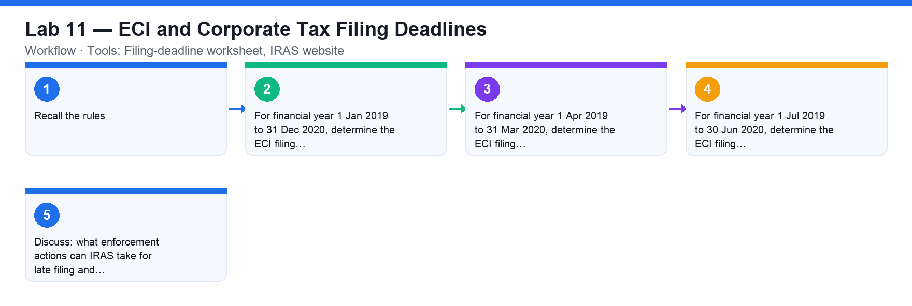

# Lab 11 — ECI and Corporate Tax Filing Deadlines

**Course:** WSQ Budgeting for Small and Medium Enterprises (TGS-2021002336)  
**Topic 07:** Financial Compliance  
**Learning outcome:** LO7 — Perform financial control to ensure compliance (A7, K6)  
**Tools:** Filing-deadline worksheet, IRAS website

## Goal

Determine when a company must file its Estimated Chargeable Income (ECI) and its corporate income tax return for a set of financial year ends.

## What you'll produce

A completed filing-deadline worksheet showing the ECI deadline and income-tax filing deadline for each financial year.

## Step-by-step

1. Recall the rules: ECI must be filed within 3 months of the financial year end; corporate income tax is e-Filed by 30 November (paper filing has been phased out from YA 2020).
2. For financial year 1 Jan 2019 to 31 Dec 2020, determine the ECI filing deadline and the income-tax filing deadline.
3. For financial year 1 Apr 2019 to 31 Mar 2020, determine the ECI filing deadline and the income-tax filing deadline.
4. For financial year 1 Jul 2019 to 30 Jun 2020, determine the ECI filing deadline and the income-tax filing deadline.
5. Discuss: what enforcement actions can IRAS take for late filing and late payment?

## Check your work

Your worksheet shows the ECI deadline (FY end + 3 months) and the correct income-tax e-Filing deadline for each financial year, and you can state the late-filing and late-payment penalties.
