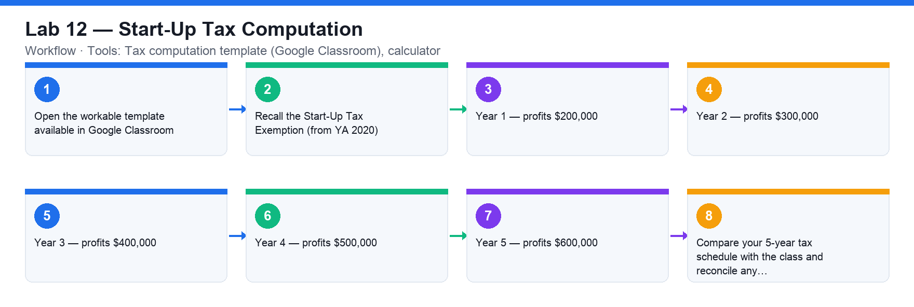

# Lab 12 — Start-Up Tax Computation

**Course:** WSQ Budgeting for Small and Medium Enterprises (TGS-2021002336)  
**Topic 07:** Financial Compliance  
**Learning outcome:** LO7 — Perform financial control to ensure compliance (A7, K6)  
**Tools:** Tax computation template (Google Classroom), calculator

## Goal

Compute the corporate tax payable by a start-up over its first five years of profits, applying the Start-Up Tax Exemption Scheme and the 17% corporate tax rate.

## What you'll produce

A completed 5-year tax computation for a start-up using the provided template.

## Step-by-step

1. Open the workable template available in Google Classroom.
2. Recall the Start-Up Tax Exemption (from YA 2020): for the first 3 YAs — 75% exemption on the first S$100,000 of chargeable income and 50% exemption on the next S$100,000; the corporate tax rate is a flat 17%.
3. Year 1 — profits $200,000: compute the exempt amount, the chargeable income after exemption and the tax at 17%.
4. Year 2 — profits $300,000: repeat the computation (still within the first 3 YAs).
5. Year 3 — profits $400,000: repeat the computation (last start-up-exemption year).
6. Year 4 — profits $500,000: compute tax without the start-up exemption (partial exemption applies from YA 4 onward).
7. Year 5 — profits $600,000: repeat the computation without the start-up exemption.
8. Compare your 5-year tax schedule with the class and reconcile any differences.

## Check your work

Your template shows, for each of the five years, the exemption applied, the chargeable income after exemption and the tax at 17% — with years 1–3 using the Start-Up Tax Exemption.
